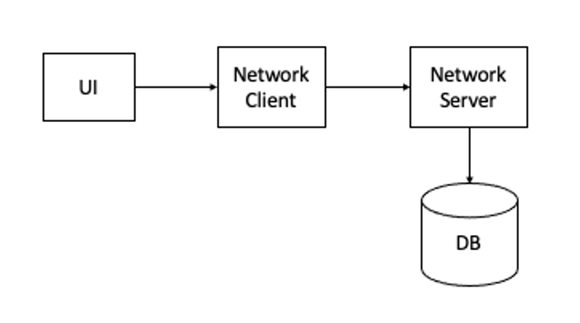
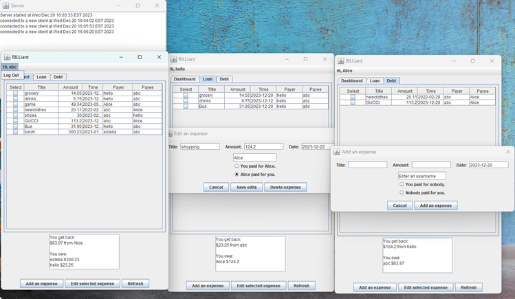

# BILLiant
A communal expense tracking JAVA app, where users can trace the bills with friends and family, and keep track of individual spending.
## Structure

###	Network
-	Server serves as an intermediate between users and the database.
-	Server saves username and password into the database during user registration.
-	Server verifies username and password during user log in.
-	Server retrieves and updates expenses in the database.
###	UI for application frontend (Swing)
-	Sign in/ Sign up
-	User dashboard (personal expenses, transaction history)
-	Add/edit an expense page
###	JDBC
-	Database tables for users, expenses
    -	User: id string, username string PRIMARY KEY, password string, key string
    -	Expense: id string PRIMARY KEY, amount double, title string, time Date, creditor User.id string, debtor string
###	Security
-	Encrypted communication between server and client
-	Encrypted password in database

## Interface

- Upon logging in, the main dashboard page displays all of the user’s transactions. Users can switch between “Debt” and “Loan” views to see money that they have lent out and money that they owe to others. The bottom of the page displays information on the total amount of money owed and lent out by the user.
- When adding an expense, users will be able to choose whether they are paying for it or whether the other user (needs to be a registered user) is paying for it.
- Each row of the displayed data can be selected and edited with a button, which brings up a screen prefilled with the current expense’s details. From this screen, users can make changes or delete the expense entirely.
- The refresh button allows users to update their view of the data, bringing in any local and server changes.
